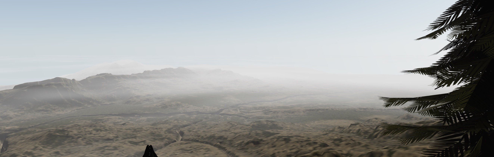

# @coconut-xr/klettern 🧗‍♀️

VR Climbing Demo - Try it out [here](coconut-xr.github.io/klettern/)

Check out our release video over on [Twitter](https://twitter.com/coconut_xr/status/1697613919617995254)

**Share your record times + videos with us on [Twitter](https://twitter.com/coconut_xr)**

---

Made with [`@coconut-xr/natuerlich`](https://github.com/coconut-xr/natuerlich), [`react-three-fiber`](https://github.com/pmndrs/react-three-fiber), and [`three.js`](https://github.com/mrdoob/three.js).

## Credits

* Win Sound - [MLaudio](https://freesound.org/people/MLaudio/)
* Grab Sound - [1bob](https://freesound.org/people/1bob/)
* Wind Sound - [JavierSerrat](https://freesound.org/people/JavierSerrat/)
* Tree Model - [Andriy Shekh](https://sketchfab.com/sheh5262)
* Rock Model - [DJMaesen](https://sketchfab.com/bumstrum)
* Landscape Model - [Šimon Ustal](https://sketchfab.com/simonustal)

---

_The demo lacks some features, so feel free to add your own implementations to the game! We'd love to see your videos about them! Pull requests are welcome!_ 🤗

---

**Klettern** is funded by [Coconut Capital](https://coconut.capital/)
